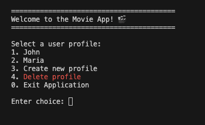
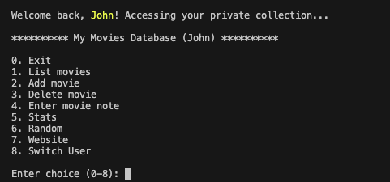
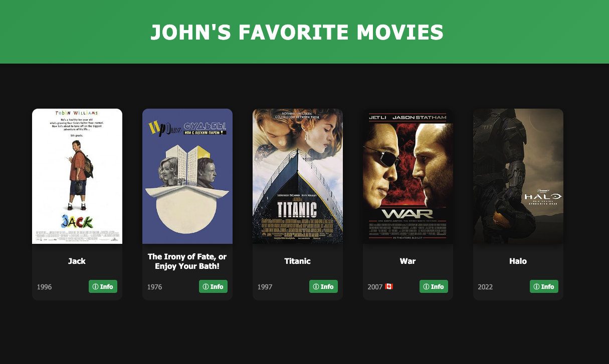

# 🎬 Multi-User Movie Database App

A professional Command-Line Interface (CLI) application and a stylish Web Gallery for managing personal movie collections. This project supports multiple user profiles, automatic movie metadata fetching from the OMDb API, and detailed statistical analysis.

## 🚀 Features

### 👤 Multi-User Support
- **Profile Management**: Create, select, and switch between different user profiles.
- **Private Collections**: Each user maintains their own independent movie list.
- **Profile Deletion**: Easily remove outdated profiles and their associated data from the initial user menu.

### 🔍 Smart Movie Management
- **OMDb Integration**: Automatically fetch movie details (Year, Rating, Poster, Country, etc.) by just entering the title.
- **Manual Entry**: Option to manually add movies if they aren't found in the database.
- **Personal Notes**: Add and update custom notes for each movie.
- **Partial Title Deletion**: Search for movies to delete using partial names.

### 📊 Advanced Statistics
Comprehensive analysis of your collection:
- **Average Rating**: Calculated across your entire library.
- **Median Rating**: Understand the center of your rating distribution.
- **Best & Worst List**: Identifies and lists all movies sharing the highest and lowest ratings.

### 🌐 Dynamic Web Gallery
Generate a stunning, responsive HTML website to showcase your collection:
- **Interactive Posters**: Hover over posters to see your personal notes.
- **IMDb Integration**: Click on posters to jump directly to the movie's IMDb page.
- **Detail Pages**: Automatically generated individual pages for every movie with full metadata.
- **Accessibility**: Includes country flags and organized layouts.

## 🖼️ Application Preview

### User Selection (Login)


### Main Application Menu


### Generated Web Gallery


## 🛠️ Technical Stack
- **Backend**: Python 3
- **Database**: SQLite3 with SQLAlchemy
- **API**: OMDb API (Open Movie Database)
- **Frontend**: HTML5, Vanilla CSS3 (Responsive Design)

## ⚙️ Setup & Installation

1. **Clone the repository**:
   ```bash
   git clone <repository-url>
   cd Movie_Project-SQL_HTML_and_API
   ```

2. **Install dependencies**:
   ```bash
   pip install requests sqlalchemy
   ```

3. **Get an API Key**:
   Register for a free API key at [omdbapi.com](https://www.omdbapi.com/apikey.aspx). The app will prompt you for this key the first time you add a movie.

4. **Run the application**:
   ```bash
   python main.py
   ```

## 📝 License
This project was developed as part of the Masterschool curriculum.
